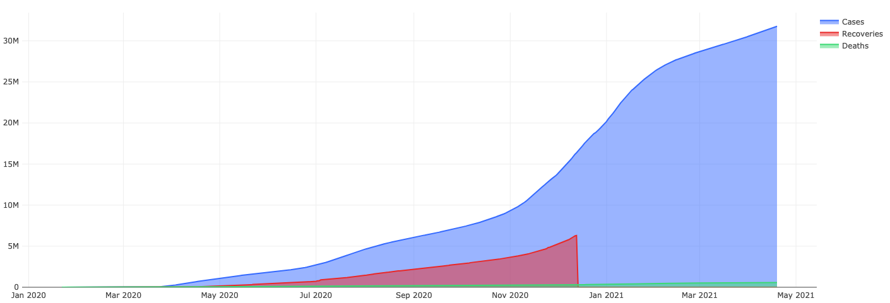

# COVID-19 ETL Pipeline
Automated ETL processing pipeline for COVID-19 data using Python and AWS

## 1. ETL Job
I created a Python compute job that runs on a daily schedule by creating a Python Lambda function and triggering it from a once-daily CloudWatch rule.
```
ETLLambda:
  Type: AWS::Serverless::Function
  DependsOn: COVID19Table
  Properties:
    FunctionName: ETLLambda
    CodeUri: .
    Handler: etl.lambda_handler
    Runtime: python3.8
    Description: A function that performs the ETL job
    MemorySize: 512
    Timeout: 120
    Environment:
      Variables:
        NYT_URL: https://raw.githubusercontent.com/nytimes/covid-19-data/master/us.csv
        JH_URL: https://raw.githubusercontent.com/datasets/covid-19/master/data/time-series-19-covid-combined.csv
        SNS_TOPIC_ARN: !Ref NotifySNS
    Policies:
      - AmazonSNSFullAccess
      - AmazonDynamoDBFullAccess
    Events:
      MyCloudWatchEvent:
        Type: Schedule
        Properties:
          Schedule: cron(00 13 ? * * *)
```
## 2. Extraction
In my Python code for `ETLLambda` (refer to `etl.py`), I downloaded CSV files from the New York Times and Johns Hopkins and loaded them into objects in memory with Pandas.
```
df_nyt = pd.read_csv(os.environ["NYT_URL"])
df_jh = pd.read_csv(os.environ["JH_URL"])
```
## 3. Transformation
In `etl.py`, I performed data manipulations to clean, filter, and join the two objects previously extracted. See next step on the `transform` module.
```
df_jh = transform.filter_rows(df_jh, "Country/Region", "US")
df_jh = transform.filter_columns(df_jh, ["Date", "Recovered"])
df_jh = df_jh.rename(columns={"Date": "date", "Recovered":"recoveries"})

df_joined = transform.merge(df_nyt, df_jh[["date", "recoveries"]], "date", "left")
df_joined = transform.drop_nonexistent(df_joined)
transform.convert_to_int_obj(df_joined, "recoveries")
```
## 4. Module
I abstracted my data manipulation work into a Python module ('transformation.py`). This module only performs transformations. It does not care where the CSV files are stored, and it does not know anything about the database in the next step.
```
import pandas as pd

# Cleaning
def convert_to_date_obj(df, field, current_format):
    df[field] = pd.to_datetime(df[field], format=current_format)
    return df

def convert_to_int_obj(df, field):
    df[field] = df[field].astype(int)

# Joining
def merge(df1, df2, on_field, how_type):
    return pd.merge(df1, df2, on=on_field, how=how_type)

# Filtering
def drop_nonexistent(df):
    return df.dropna()

def filter_rows(df, field, select):
    return df[df[field] == select]

def filter_columns(df, cols):
    return df[cols]
```
## 5. Load
In `etl.py`, I loaded my transformed data into a database. In an attempt to go serverless and be cost-effective, I used DynamoDB with boto3 and made sure that each record in that table has the date, US case counts, deaths, and recoveries for a day of the pandemic. See Python script to view functions written prior to `lambda_handler` for work done to compare current and new data before storing new data to DynamoDB table. Below is DynamoDB table created to store the data.
```
COVID19Table:
  Type: AWS::DynamoDB::Table
  Properties:
    TableName: covid-19-table
    AttributeDefinitions:
      - AttributeName: date
        AttributeType: S
    KeySchema:
      - AttributeName: date
        KeyType: HASH
    BillingMode: PAY_PER_REQUEST
    StreamSpecification:
      StreamViewType: NEW_IMAGE
```
## 6. Notification
I created another Lambda function (`NotifyLambda`) that would be invoke by DynamoDB Streams, when there has been a change to the table. I had my code for this function (`notify.py`) trigger an SNS message (SNS topic `NotifySNS` created) to notify any interested consumers that the ETL job has completed. The message includes the rows updated in the database.
```
NotifyLambda:
  Type: AWS::Serverless::Function
  DependsOn: COVID19Table
  Properties:
    FunctionName: NotifyLambda
    CodeUri: .
    Handler: notify.alert
    Runtime: python3.8
    Description: A function that notifies the subscriber via SNS
    MemorySize: 512
    Timeout: 120
    Environment:
      Variables:
        SNS_TOPIC_ARN: !Ref NotifySNS
    Policies:
      - AmazonSNSFullAccess
      - AmazonDynamoDBFullAccess
    Events:
      Stream:
        Type: DynamoDB
        Properties:
          Enabled: true
          Stream: !GetAtt COVID19Table.StreamArn
          BatchSize: 100
          MaximumBatchingWindowInSeconds: 10
          StartingPosition: LATEST
```
## 7. Error Handling
To handle common control flow situations, I added `try` and `except` in order for my code to fail gracefully and report an error message via SNS.
<pre>
<b>try:</b>
    # Extraction
    df_nyt = pd.read_csv(os.environ["NYT_URL"])
    df_jh = pd.read_csv(os.environ["JH_URL"])

    # Transformation
    df_jh = transform.filter_rows(df_jh, "Country/Region", "US")
    df_jh = transform.filter_columns(df_jh, ["Date", "Recovered"])
    df_jh = df_jh.rename(columns={"Date": "date", "Recovered":"recoveries"})

    df_joined = transform.merge(df_nyt, df_jh[["date", "recoveries"]], "date", "left")
    df_joined = transform.drop_nonexistent(df_joined)
    transform.convert_to_int_obj(df_joined, "recoveries")

    # Load
    new_data = data_diff(db_table, df_joined)
    logger.info("New data: %s", new_data)
    db_store(db_table, new_data, logger)
<b>except Exception as e:</b>
    # Doing a general catch because I want all errors to be pushed to SNS
    sns.publish(TopicArn=topic_arn, Message=(
        f"There was an error in function {context.function_name}.\n"
        f"Please see log {context.log_group_name} for more info.\n"
        f"Error: {e}"
    ))
    <b>exit(1)</b>
</pre>
## 8. Tests
To ensure that my code can handle unexpected situations, I included unit tests for my code that substitute invalid data for the COVID-19 CSV files and confirmed that my code responds correctly. I used the unittest package and tested `test.py` in the `venv` environment.
```
class Test(unittest.TestCase):
    """Tests functions"""

    def test_convert_date(self):
        """Tests converting date"""
        df = pd.DataFrame({"date":'2020-01-01',"cases": [1],"deaths": [2], "recoveries": [3]})
        df = transform.convert_to_date_obj(df, "date", '%Y-%m-%d')
        self.assertEqual(df['date'].dtypes, "datetime64[ns]")

    def test_filter_criteria(self):
        """Tests filtering based on a criteria"""
        df = pd.DataFrame(
            {
                "date": ["2020-01-01","2020-01-02", "2020-01-03"],
                "cases": [1,2,3],
                "deaths": [2,4,6],
                "recoveries": [3,6,9]
            }
        )
        compare_df = pd.DataFrame({"date":'2020-01-01',"cases": [1],"deaths": [2], "recoveries": [3]})
        df = transform.filter_rows(df, "date", "2020-01-01")
        assert_frame_equal(df, compare_df)

    def test_find_new(self):
        """ Tests finding new entries (by using a diff mechanism)"""
        old_df = pd.DataFrame(
            {
                "date": ["2020-01-01", "2020-01-02", "2020-01-03"],
                "cases": [1, 2, 3],
                "deaths": [2, 4, 6],
                "recoveries": [3, 6, 9],
            }
        )

        new_df = pd.DataFrame(
            {
                "date": ["2020-01-01", "2020-01-02", "2020-01-03", "2020-01-04"],
                "cases": [1, 2, 3, 6],
                "deaths": [2, 4, 6, 8],
                "recoveries": [3, 6, 9, 12],
            }
        )
        df = etl.find_new(old_df, new_df)
        diff_df = pd.DataFrame({"date":'2020-01-04',"cases": [6],"deaths": [8], "recoveries": [12]})
        assert_frame_equal(df.reset_index(drop=True), diff_df.reset_index(drop=True))


if __name__ == "__main__":
    unittest.main()
```
## 9. IaC
I made sure my infrastructure (Lambda functions, SNS topic, DynamoDB table) is defined in code (`template.yaml`) with CloudFormation, specifically as a SAM template since I was creating Lambda functions via `sam build` and `sam deploy` commands.
## 10. Source Control
I stored my code and config in [GitHub](https://github.com/padili513/COVID-19-ETL-Pipeline).
## 11. Dashboard
I hooked my database up to [Redash](https://app.redash.io/pedram-adili/public/dashboards/K5cKF9uqczqzoI4uVoUL05p4nsSgFlM4RrXxSiZv). Note: I signed up for only the 30 day free trial, so link to dashboard won't be up for long. I generated a visualization of US case counts, fatality, and recoveries over time. Another note: For some reason Johns Hopkins stopped tracking the number of recoveries after December 13th, 2020, and I verified on their CSV file.

